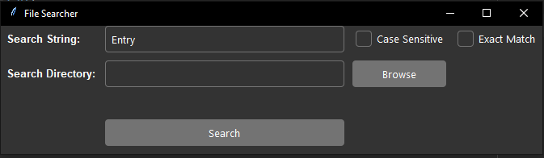
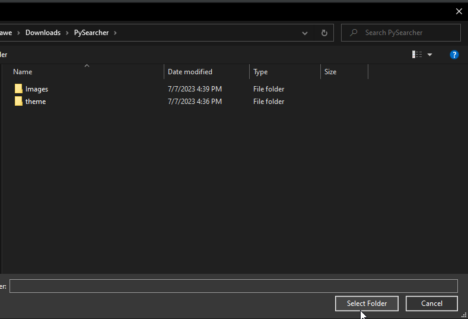
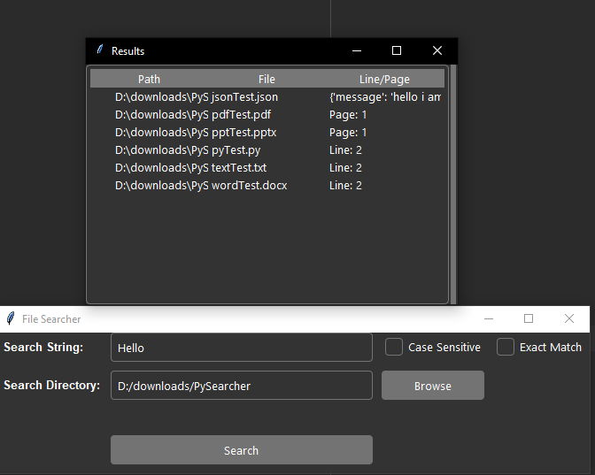

# PySearcher

## Introduction
PySearcher is a Python script that allows you to search for a specific string within various file formats. It provides a convenient way to find occurrences of a string in documents, code files, PDFs, PowerPoint presentations, and more.

## How to Use
1. Clone the repository to your local machine.
2. Install the required dependencies by running `pip install python-docx PyPDF2 python-pptx` in your terminal or command prompt.
3. Open a terminal or command prompt and navigate to the directory where the script is located.
4. Run the script using the command `python file_searcher.py`.
5. Enter the string you want to search for.
6. Specify your search preferences, including case sensitivity and exact match.
7. specify the directory to search for.

## Sample run

1. **Run the script to see the main menu**

2. **Add the string to search for and adjust your settings**

3. **Select the directory to search**

4. **The output**

## Capabilities
- Supported file formats include .docx, .py, .txt, .json, .pdf, and .pptx.
- The script can perform both case-sensitive and case-insensitive searches based on user preference.
- You can choose to search for an exact match or partial matches within the files.
- Uses the beautiful [Azure theme](https://github.com/rdbende/Azure-ttk-theme/tree/main) by [rdbende](https://github.com/rdbende)

  
## Limitations
- Limited support for non-English languages due to potential encoding issues.
- Search accuracy may depend on the quality of the file content extraction for specific formats.
- Some file formats may require additional dependencies or libraries for parsing and extraction.

## Future Work
1. Make the GUI better.
2. Add support for a recursive search for subdirectories.
3. Make a web version where people could upload to the application and get results.
4. Add more supported file formats.

Feel free to contribute, report any issues, or suggest improvements by creating an issue or submitting a pull request.

  
